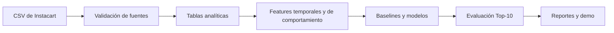

<p align="center">
  
</p>

<h1 align="center">Instacart Recommender</h1>

<p align="center">
  <a href="https://www.python.org/">
    
  </a>
  <a href="https://duckdb.org/">
    
  </a>
  <a href="https://lightgbm.readthedocs.io/">
    
  </a>
  <a href="tests/test_metrics.py">
    
  </a>
  <a href="#estado-del-proyecto">
    
  </a>
</p>

Sistema de recomendación **Top-10** desarrollado sobre el historial de compras de Instacart. El proyecto integra procesamiento reproducible, análisis exploratorio, ingeniería de características, modelado supervisado y evaluación offline bajo un protocolo temporal sin fuga de información.

> **Estado actual:** pipeline, EDA, baselines, modelos y evaluación finalizados. La demo interactiva, el dashboard y la documentación de usuario se encuentran en integración para la Demo final.

## Contenido

- [Objetivo](#objetivo)
- [Resultados](#resultados)
- [Arquitectura](#arquitectura)
- [Datos y evaluación](#datos-y-evaluación)
- [Cómo reproducir el proyecto](#cómo-reproducir-el-proyecto)
- [Estructura del repositorio](#estructura-del-repositorio)
- [Documentación y notebooks](#documentación-y-notebooks)
- [Estado del proyecto](#estado-del-proyecto)
- [Equipo](#equipo)
- [Limitaciones](#limitaciones)

## Objetivo

Generar diez recomendaciones de productos por usuario a partir de su historial de compras y comparar cada propuesta con dos referencias reproducibles:

- **popularidad global:** los mismos productos frecuentes para todos los usuarios;
- **recompra personal:** productos históricos de cada usuario ordenados por frecuencia relativa y recencia.

El desarrollo busca responder dos necesidades diferentes:

1. facilitar la recompra de productos habituales;
2. explorar la recomendación de productos nuevos relevantes.

## Resultados

Los cinco sistemas se evaluaron con la misma función, el mismo corte `K=10` y los mismos **26.243 usuarios de validación**.

| Modelo | Precision@10 | Recall@10 macro | Recall@10 micro | Hit Rate@10 | Cobertura |
|---|---:|---:|---:|---:|---:|
| Popularidad global | 0,0727 | 0,0702 | 0,0687 | 0,4607 | 0,0002 |
| Recompra personal | 0,2751 | 0,3271 | 0,2599 | 0,8551 | **0,4495** |
| Heurística | 0,2850 | 0,3385 | 0,2693 | 0,8545 | 0,4331 |
| Regresión logística | 0,2944 | 0,3480 | 0,2782 | 0,8681 | 0,3692 |
| **LightGBM** | **0,3026** | **0,3556** | **0,2859** | **0,8720** | 0,3897 |

**LightGBM obtuvo el mejor rendimiento predictivo actual.** Frente al baseline de recompra personal aumentó el Recall@10 macro en aproximadamente 2,85 puntos porcentuales y el Hit Rate@10 en 1,69 puntos.

La cobertura se interpreta como amplitud del catálogo recomendado y no como sinónimo de descubrimiento. Un sistema de recompra puede cubrir muchos productos globalmente aunque nunca recomiende a una persona algo fuera de su historial.

Los valores completos y reproducibles se encuentran en [`reports/comparacion_final.csv`](reports/comparacion_final.csv). La interpretación metodológica está documentada en [`docs/analisis_resultados_y_metricas.md`](docs/analisis_resultados_y_metricas.md).

## Arquitectura



El procesamiento conserva la granularidad de las fuentes y construye salidas especializadas para catálogo, usuarios, productos, interacciones y objetivos de evaluación.

## Datos y evaluación

El proyecto utiliza el conjunto público [Instacart Market Basket Analysis](https://www.kaggle.com/competitions/instacart-market-basket-analysis/data), compuesto por seis archivos:

- `orders.csv`
- `order_products__prior.csv`
- `order_products__train.csv`
- `products.csv`
- `aisles.csv`
- `departments.csv`

Los archivos originales deben ubicarse localmente en `data/raw/` y no se almacenan en Git debido a su volumen.

### Protocolo

- `prior` representa el historial disponible para construir variables y candidatos;
- `train` contiene la orden objetivo y se reserva para evaluación;
- el split de entrenamiento y validación es temporal;
- ningún modelo puede utilizar información de la orden objetivo para generar variables;
- todos los sistemas se comparan sobre los mismos usuarios, targets y métricas;
- el corte oficial es `K=10`.

El repositorio diferencia dos universos que no deben mezclarse:

- **131.209 usuarios evaluables:** análisis global de baseline, candidatos y novedad;
- **26.243 usuarios de validación:** comparación oficial de los modelos.

## Cómo reproducir el proyecto

### Inicio rápido

```powershell
git clone https://github.com/Diiimas/instacart-recommender.git
cd instacart-recommender
py -3.12 -m venv .venv
.\.venv\Scripts\Activate.ps1
python -m pip install -r requirements.txt
pytest -q
```

La preparación de los datos y la ejecución completa requieren descargar previamente los seis CSV de Instacart. Consultá [`SETUP.md`](SETUP.md) para ver el procedimiento y las salidas esperadas.

Para regenerar la comparación final, una vez construidas las tablas procesadas y las features:

```powershell
python src/models/comparar_todos.py
```

El comando entrena y evalúa los cinco sistemas sobre el mismo conjunto de validación y actualiza `reports/comparacion_final.csv`.

## Estructura del repositorio

```text
instacart-recommender/
├── data/
│   ├── raw/                 # CSV originales, no versionados
│   ├── interim/             # archivos temporales
│   └── processed/           # tablas analíticas, no versionadas
├── docs/                    # contrato, diccionario y análisis
├── notebooks/               # EDA, calidad y baselines
├── reports/                 # métricas, parámetros e importancias
├── src/
│   ├── data/                # carga, validación y construcción
│   ├── evaluation/          # protocolo y métricas comunes
│   ├── features/            # tabla de variables
│   └── models/              # baselines, heurística, RL y LightGBM
├── tests/                   # pruebas unitarias de métricas
├── README.md
├── SETUP.md
└── requirements.txt
```

## Documentación y notebooks

### Documentación

- [Contrato de datos](docs/data_contract.md)
- [Diccionario de tablas procesadas](docs/data_dictionary.md)
- [Análisis de resultados y métricas](docs/analisis_resultados_y_metricas.md)
- [Configuración del entorno](SETUP.md)

### Notebooks

- [`01_EDA_decisiones.ipynb`](notebooks/01_EDA_decisiones.ipynb): EDA orientado a decisiones.
- [`02_calidad_data.ipynb`](notebooks/02_calidad_data.ipynb): integridad, distribuciones y outliers.
- [`03_baseline.ipynb`](notebooks/03_baseline.ipynb): protocolo y baselines.
- [`04_eda_features_para_modelo.ipynb`](notebooks/04_eda_features_para_modelo.ipynb): análisis de features, segmentos y control cualitativo.

## Estado del proyecto

| Componente | Estado |
|---|---|
| Validación y pipeline | ✅ Terminado |
| EDA y análisis de calidad | ✅ Terminado |
| Ingeniería de características | ✅ Terminada |
| Baselines y modelos | ✅ Terminados |
| Protocolo y pruebas de métricas | ✅ 32 pruebas aprobadas |
| Comparación final | ✅ Terminada |
| Demo interactiva | 🚧 En integración |
| Dashboard | 🚧 En desarrollo |
| Manual de usuario | 🚧 En desarrollo |

## Equipo

| Integrante | Rol principal |
|---|---|
| Dimas Giménez | Data Engineer y líder técnico |
| Anastasia Ganderats | Data Analyst — EDA y análisis de resultados |
| Julieta Zuccaro | Data Scientist — modelado y evaluación |
| Leonardo Jara | Business Analyst — negocio y documentación |

Los roles representan áreas de liderazgo. La integración y revisión del producto son responsabilidad de todo el equipo.

## Limitaciones

- La evaluación es offline y utiliza la última orden conocida como objetivo.
- La naturaleza del dataset favorece la recompra y dificulta medir descubrimiento con la misma métrica.
- Los archivos originales y procesados no se incluyen en el repositorio por su volumen.
- La comparación oficial mide ranking sobre candidatos disponibles; la generación de productos nuevos se evalúa por separado.
- La demo y el dashboard todavía están en integración y no representan un despliegue productivo.

