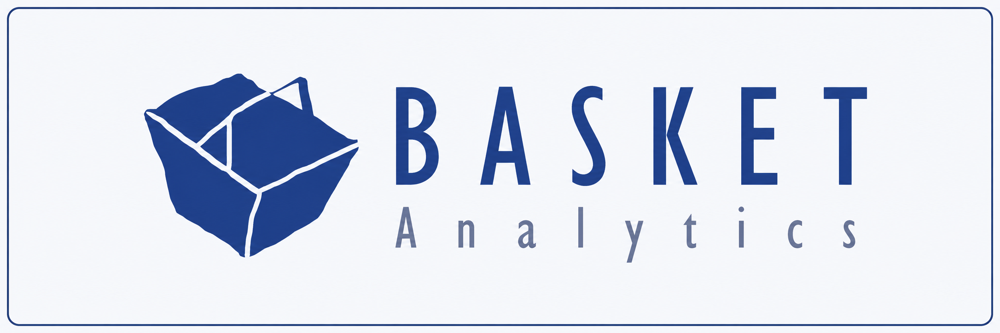
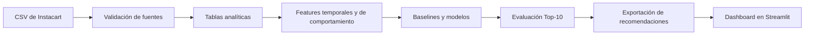

<p align="center">
  
</p>

<h1 align="center">Instacart Recommender</h1>

<p align="center">
  <a href="https://www.python.org/">
    
  </a>
  <a href="https://duckdb.org/">
    
  </a>
  <a href="https://lightgbm.readthedocs.io/">
    
  </a>
  <a href="https://github.com/Diiimas/instacart-recommender/actions/workflows/ci.yml">
    
  </a>
  <a href="tests/">
    
  </a>
  <a href="https://basket-analytics-instacart.streamlit.app">
    
  </a>
</p>

Sistema de recomendación desarrollado sobre el historial de compras de Instacart para anticipar el próximo carrito de cada cliente. El proyecto integra procesamiento reproducible, análisis exploratorio, ingeniería de características, modelado supervisado, evaluación offline y una demo interactiva desplegada públicamente.

> **Demo pública:** [Basket Analytics — Instacart Recommender](https://basket-analytics-instacart.streamlit.app)

> **Estado actual:** pipeline, EDA, baselines, modelos, evaluación, sistema final, pruebas y dashboard terminados. La integración continua valida automáticamente el código y los archivos necesarios para la demo.

## Contenido

- [Objetivo](#objetivo)
- [Sistema final](#sistema-final)
- [Resultados](#resultados)
- [Demo interactiva](#demo-interactiva)
- [Arquitectura](#arquitectura)
- [Datos y evaluación](#datos-y-evaluación)
- [Cómo reproducir el proyecto](#cómo-reproducir-el-proyecto)
- [Integración continua](#integración-continua)
- [Estructura del repositorio](#estructura-del-repositorio)
- [Documentación y notebooks](#documentación-y-notebooks)
- [Estado del proyecto](#estado-del-proyecto)
- [Equipo](#equipo)
- [Limitaciones](#limitaciones)

## Objetivo

Anticipar los productos que podrían formar parte del próximo carrito de cada usuario a partir de su historial de compras.

El desarrollo busca responder dos necesidades diferentes:

1. facilitar la recompra de productos habituales;
2. explorar productos nuevos que podrían resultar relevantes.

Para evaluar el ranking de recompra, cada modelo se compara con dos referencias reproducibles:

- **popularidad global:** los mismos productos frecuentes para todos los usuarios;
- **recompra personal:** productos históricos de cada usuario ordenados por frecuencia relativa y recencia.

## Sistema final

El recomendador entrega dos bloques independientes:

- **Carrito habitual:** hasta 10 productos de recompra, ordenados por el modelo LightGBM.
- **También podrías necesitar:** productos nuevos sugeridos mediante reglas de asociación y afinidad de categoría.

La cantidad máxima de sugerencias nuevas depende del nivel de historial del usuario:

| Segmento | Máximo de productos nuevos |
|---|---:|
| Nuevo | 5 |
| Medio | 2 |
| Heavy | 1 |

Estos valores son máximos y no garantías. Un usuario puede recibir menos productos cuando su historial o el conjunto de candidatos no permiten completar el bloque con recomendaciones válidas.

Las sugerencias nuevas se muestran de forma separada y no desplazan productos del carrito habitual.

## Resultados

Los cinco sistemas de recompra se evaluaron con la misma función, el mismo corte `K=10` y los mismos **26.243 usuarios de validación**.

| Modelo | Precision@10 | Recall@10 macro | Recall@10 micro | Hit Rate@10 | Cobertura |
|---|---:|---:|---:|---:|---:|
| Popularidad global | 0,0727 | 0,0702 | 0,0687 | 0,4607 | 0,0002 |
| Recompra personal | 0,2751 | 0,3271 | 0,2599 | 0,8551 | **0,4495** |
| Heurística | 0,2850 | 0,3385 | 0,2693 | 0,8545 | 0,4331 |
| Regresión logística | 0,2944 | 0,3480 | 0,2782 | 0,8681 | 0,3692 |
| **LightGBM** | **0,3026** | **0,3556** | **0,2859** | **0,8720** | 0,3897 |

**LightGBM obtuvo el mejor rendimiento predictivo actual.** Frente al baseline de recompra personal aumentó el Recall@10 macro en aproximadamente 2,85 puntos porcentuales y el Hit Rate@10 en 1,69 puntos.

La cobertura se interpreta como amplitud del catálogo recomendado y no como sinónimo de descubrimiento. Un sistema de recompra puede cubrir muchos productos globalmente aunque nunca recomiende a una persona algo fuera de su historial.

Los valores completos y reproducibles se encuentran en [`reports/comparacion_final.csv`](reports/comparacion_final.csv). La interpretación metodológica está documentada en [`docs/analisis_resultados_y_metricas.md`](docs/analisis_resultados_y_metricas.md).

## Demo interactiva

La aplicación pública permite:

- recorrer los resultados y las métricas principales;
- comparar modelos y segmentos de usuarios;
- analizar el comportamiento del sistema;
- explorar recomendaciones individuales;
- distinguir entre productos habituales y sugerencias nuevas.

La demo consume recomendaciones precalculadas y versionadas en `reports/`. No reentrena el modelo durante la navegación ni necesita los datos originales de Instacart en el entorno de Streamlit Cloud.

**Acceso:** [basket-analytics-instacart.streamlit.app](https://basket-analytics-instacart.streamlit.app)

## Arquitectura



El procesamiento conserva la granularidad de las fuentes y construye salidas especializadas para catálogo, usuarios, productos, interacciones, objetivos de evaluación y visualización.

## Datos y evaluación

El proyecto utiliza el conjunto público [Instacart Market Basket Analysis](https://www.kaggle.com/competitions/instacart-market-basket-analysis/data), compuesto por seis archivos:

- `orders.csv`
- `order_products__prior.csv`
- `order_products__train.csv`
- `products.csv`
- `aisles.csv`
- `departments.csv`

Los archivos originales deben ubicarse localmente en `data/raw/` y no se almacenan en Git debido a su volumen.

### Protocolo

- `prior` representa el historial disponible para construir variables y candidatos;
- `train` contiene la orden objetivo y se reserva para evaluación;
- el split de entrenamiento y validación es temporal;
- ningún modelo puede utilizar el contenido de la orden objetivo para generar variables;
- todos los sistemas se comparan sobre los mismos usuarios, targets y métricas;
- el corte oficial para el ranking de recompra es `K=10`;
- los empates del ranking se resuelven mediante `product_id` ascendente.

El repositorio diferencia dos universos que no deben mezclarse:

- **131.209 usuarios evaluables:** análisis global de baselines, candidatos y novedad;
- **26.243 usuarios de validación:** comparación oficial de los modelos.

## Cómo reproducir el proyecto

### Inicio rápido

```powershell
git clone https://github.com/Diiimas/instacart-recommender.git
cd instacart-recommender
py -3.12 -m venv .venv
.\.venv\Scripts\Activate.ps1
python -m pip install -r requirements.txt
python -m pytest tests/ -q
```

La preparación de los datos y la ejecución completa requieren descargar previamente los seis CSV de Instacart. Consultá [`SETUP.md`](SETUP.md) para ver el procedimiento y las salidas esperadas.

Para regenerar la comparación final, una vez construidas las tablas procesadas y las features:

```powershell
python src/models/comparar_todos.py
```

El comando entrena y evalúa los cinco sistemas de recompra sobre el mismo conjunto de validación y actualiza `reports/comparacion_final.csv`.

Para ejecutar localmente el dashboard con las recomendaciones exportadas:

```powershell
streamlit run dashboard.py
```

## Integración continua

El workflow de GitHub Actions se ejecuta ante:

- cada `push` a `main`;
- cada pull request dirigido a `main`;
- una ejecución manual mediante `workflow_dispatch`.

La validación automática utiliza Python 3.12, instala las dependencias y comprueba:

- las 59 pruebas automatizadas;
- la compilación de `dashboard.py`;
- la presencia de los archivos requeridos por la demo.

El workflow actual valida la integración del repositorio, pero **no descarga los datos originales, reentrena automáticamente los modelos ni registra experimentos en una plataforma de tracking**.

## Estructura del repositorio

```text
instacart-recommender/
├── .github/
│   └── workflows/           # integración continua
├── .streamlit/              # configuración de la demo
├── assets/                  # identidad visual
├── data/
│   ├── raw/                 # CSV originales, no versionados
│   ├── interim/             # archivos temporales
│   └── processed/           # tablas analíticas, no versionadas
├── docs/                    # contrato, diccionario y análisis
├── notebooks/               # EDA, calidad, baselines y asociaciones
├── reports/                 # métricas y datos precalculados de la demo
├── src/
│   ├── data/                # carga, validación y construcción
│   ├── evaluation/          # protocolo y métricas comunes
│   ├── features/            # tablas de variables
│   └── models/              # baselines, modelos y sistema final
├── tests/                   # pruebas de métricas y recomendador
├── dashboard.py             # aplicación interactiva
├── README.md
├── SETUP.md
└── requirements.txt
```

## Documentación y notebooks

### Documentación

- [Contrato de datos](docs/data_contract.md)
- [Diccionario de tablas procesadas](docs/data_dictionary.md)
- [Análisis de resultados y métricas](docs/analisis_resultados_y_metricas.md)
- [Configuración del entorno](SETUP.md)

### Notebooks

- [`01_EDA_decisiones.ipynb`](notebooks/01_EDA_decisiones.ipynb): EDA orientado a decisiones.
- [`02_calidad_data.ipynb`](notebooks/02_calidad_data.ipynb): integridad, distribuciones y outliers.
- [`03_baseline.ipynb`](notebooks/03_baseline.ipynb): protocolo y baselines.
- [`04_eda_features_para_modelo.ipynb`](notebooks/04_eda_features_para_modelo.ipynb): análisis de features, segmentos y control cualitativo.
- [`05_reglas_asociacion_y_categoria.ipynb`](notebooks/05_reglas_asociacion_y_categoria.ipynb): análisis de reglas de asociación y categorías para productos nuevos.

## Estado del proyecto

| Componente | Estado |
|---|---|
| Validación y pipeline | ✅ Terminado |
| EDA y análisis de calidad | ✅ Terminado |
| Ingeniería de características | ✅ Terminada |
| Baselines y modelos | ✅ Terminados |
| Sistema final de dos bloques | ✅ Terminado |
| Protocolo y pruebas automatizadas | ✅ 59 pruebas aprobadas |
| Comparación final | ✅ Terminada |
| Demo y dashboard | ✅ Desplegados |
| Integración continua | ✅ Activa |
| Reentrenamiento automático y tracking | No implementados |

## Equipo

| Integrante | Rol principal |
|---|---|
| Dimas Giménez | Data Engineer y líder técnico |
| Anastasia Ganderats | Data Analyst — EDA y análisis de resultados |
| Julieta Zuccaro | Data Scientist — modelado y evaluación |
| Leonardo Jara | Business Analyst — negocio y documentación |

Los roles representan áreas de liderazgo. La integración y revisión del producto son responsabilidad de todo el equipo.

## Limitaciones

- La evaluación es offline y utiliza la última orden conocida como objetivo.
- La naturaleza del dataset favorece la recompra y dificulta medir descubrimiento con la misma métrica.
- Los archivos originales y procesados no se incluyen en el repositorio por su volumen.
- La comparación oficial mide ranking sobre candidatos disponibles; la generación de productos nuevos se evalúa por separado.
- Las reglas de asociación describen coocurrencias históricas y no demuestran por sí solas complementariedad o causalidad.
- El dataset no incluye variables como precios y promociones, por lo que su posible aporte constituye una hipótesis y no una mejora demostrada.
- La demo utiliza recomendaciones precalculadas y no representa un sistema de inferencia ni reentrenamiento en tiempo real.
- La integración continua actual valida el producto de software, pero no automatiza el ciclo completo de MLOps.