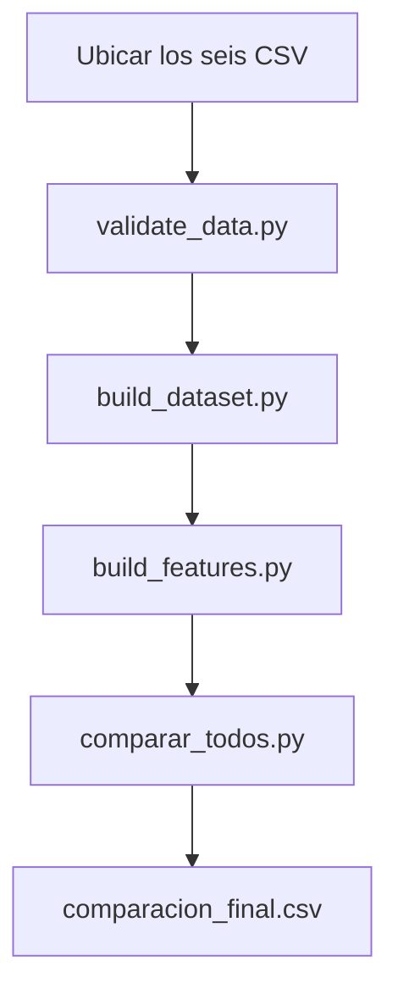

# Configuración y reproducción del proyecto

Este documento explica cómo preparar el entorno local, validar los datos, reconstruir las tablas analíticas y reproducir la comparación final de modelos de `instacart-recommender`.

## 1. Requisitos previos

- Git
- Python **3.12.10** de 64 bits
- Visual Studio Code
- Extensiones de VS Code:
  - Python
  - Jupyter

El procesamiento completo trabaja con más de 32 millones de compras históricas. Se recomienda cerrar aplicaciones pesadas durante las etapas de construcción de features o candidatos y disponer de espacio libre para archivos temporales.

## 2. Clonar el repositorio

```powershell
git clone https://github.com/Diiimas/instacart-recommender.git
cd instacart-recommender
```

Todos los comandos de este documento deben ejecutarse desde la raíz del repositorio.

## 3. Crear y activar el entorno virtual

Crear el entorno con Python 3.12:

```powershell
py -3.12 -m venv .venv
```

Activarlo en PowerShell:

```powershell
.\.venv\Scripts\Activate.ps1
```

El prompt debería comenzar con `(.venv)`. Verificar la versión:

```powershell
python --version
```

Salida esperada:

```text
Python 3.12.10
```

## 4. Instalar dependencias

Actualizar `pip` e instalar las versiones declaradas:

```powershell
python -m pip install --upgrade pip
python -m pip install -r requirements.txt
```

Verificar que no existan incompatibilidades:

```powershell
python -m pip check
```

El proyecto utiliza DuckDB para el pipeline y PyArrow como motor de Parquet para los scripts que leen las tablas mediante Pandas.

## 5. Descargar y ubicar los datos

Descargar el conjunto [Instacart Market Basket Analysis](https://www.kaggle.com/competitions/instacart-market-basket-analysis/data) y colocar estos seis archivos sin modificar dentro de `data/raw/`:

```text
data/raw/
├── aisles.csv
├── departments.csv
├── order_products__prior.csv
├── order_products__train.csv
├── orders.csv
└── products.csv
```

Los datos no se versionan en Git debido a su volumen.

## 6. Validar las fuentes

Ejecutar los controles de columnas requeridas, rangos, claves y relaciones:

```powershell
python src/data/validate_data.py
```

La ejecución correcta termina con:

```text
Todas las validaciones fueron superadas.
Los archivos originales no fueron modificados.
```

## 7. Construir la base analítica

```powershell
python src/data/build_dataset.py
```

El pipeline lee los CSV mediante DuckDB, conserva separado el historial `prior` del objetivo `train` y genera:

```text
data/processed/
├── catalogo.parquet
├── targets_train.parquet
├── productos.parquet
├── usuarios.parquet
└── interacciones.parquet
```

Cantidades de referencia de la ejecución completa:

| Salida | Contenido esperado |
|---|---:|
| `catalogo.parquet` | 49.688 productos |
| `targets_train.parquet` | 1.384.617 productos objetivo de 131.209 usuarios |
| `productos.parquet` | 49.688 perfiles de producto |
| `usuarios.parquet` | 206.209 perfiles de usuario |
| `interacciones.parquet` | 13.307.953 pares usuario-producto |

Las tablas de productos, usuarios e interacciones representan **32.434.489 compras históricas**.

## 8. Construir las features de modelado

Antes de ejecutar el procesamiento completo puede realizarse una prueba con 5.000 usuarios:

```powershell
python src/features/build_features.py --usuarios 5000 --salida data/processed/features_piloto.parquet
```

Para generar la tabla oficial:

```powershell
python src/features/build_features.py
```

Salida:

```text
data/processed/features.parquet
```

La partición es determinista, se realiza por usuario completo y queda estratificada por segmento. La orden objetivo se utiliza exclusivamente para construir la etiqueta.

## 9. Reproducir la comparación final

Con `features.parquet` disponible:

```powershell
python src/models/comparar_todos.py
```

El script ejecuta y evalúa, bajo el mismo protocolo:

1. popularidad global;
2. recompra personal;
3. heurística;
4. regresión logística;
5. LightGBM.

La tabla final se guarda en:

```text
reports/comparacion_final.csv
```

También puede modificarse el corte de recomendación:

```powershell
python src/models/comparar_todos.py --k 5
```

El valor oficial del proyecto es `K=10`.

## 10. Ejecutar las pruebas

Las pruebas unitarias no necesitan los CSV originales ni las tablas procesadas:

```powershell
pytest -q
```

Estado validado del repositorio:

```text
32 passed
```

Las pruebas verifican el comportamiento del módulo común de métricas, incluidos casos límite, segmentación y comparación contra baselines.

## 11. Generación experimental de candidatos nuevos

Este módulo es opcional y no reemplaza al ranking oficial de LightGBM. Excluye productos ya comprados e intenta aportar candidatos para descubrimiento.

Prueba piloto:

```powershell
python src/models/generate_candidates.py --max-usuarios 5000 --memory-limit 4GB --threads 4
```

Ejecución completa:

```powershell
python src/models/generate_candidates.py --memory-limit 4GB --threads 4
```

Salida local, no versionada:

```text
data/processed/candidatos_nuevos.parquet
```

En el equipo de referencia, la ejecución completa procesó 206.209 usuarios y tardó aproximadamente 22 minutos. El tiempo depende del hardware y del uso de almacenamiento temporal.

Para evaluar los candidatos ya generados:

```powershell
python src/evaluation/evaluate_candidates.py --memory-limit 4GB --threads 4
```

## 12. Orden mínimo de reproducción



## 13. Problemas frecuentes

### PowerShell no encuentra el activador

Usar la ruta completa relativa, incluyendo el punto inicial y el nombre `.venv`:

```powershell
.\.venv\Scripts\Activate.ps1
```

### Pandas no puede leer Parquet

Confirmar que el entorno esté activo y que `pyarrow` esté instalado:

```powershell
python -c "import pyarrow; print(pyarrow.__version__)"
```

Después, si es necesario:

```powershell
python -m pip install -r requirements.txt
```

### Faltan archivos procesados

Ejecutar nuevamente, en orden:

```powershell
python src/data/validate_data.py
python src/data/build_dataset.py
python src/features/build_features.py
```

### Consumo elevado de memoria

No ejecutar simultáneamente la construcción de features, el generador de candidatos y los notebooks. El generador permite reducir memoria e hilos mediante `--memory-limit` y `--threads`.

## 14. Demo interactiva

La interfaz de demostración se encuentra en integración durante el Sprint 2. Cuando quede incorporada, esta sección deberá indicar el comando único de inicio y el flujo de uso para seleccionar un usuario y obtener su Top-10.

